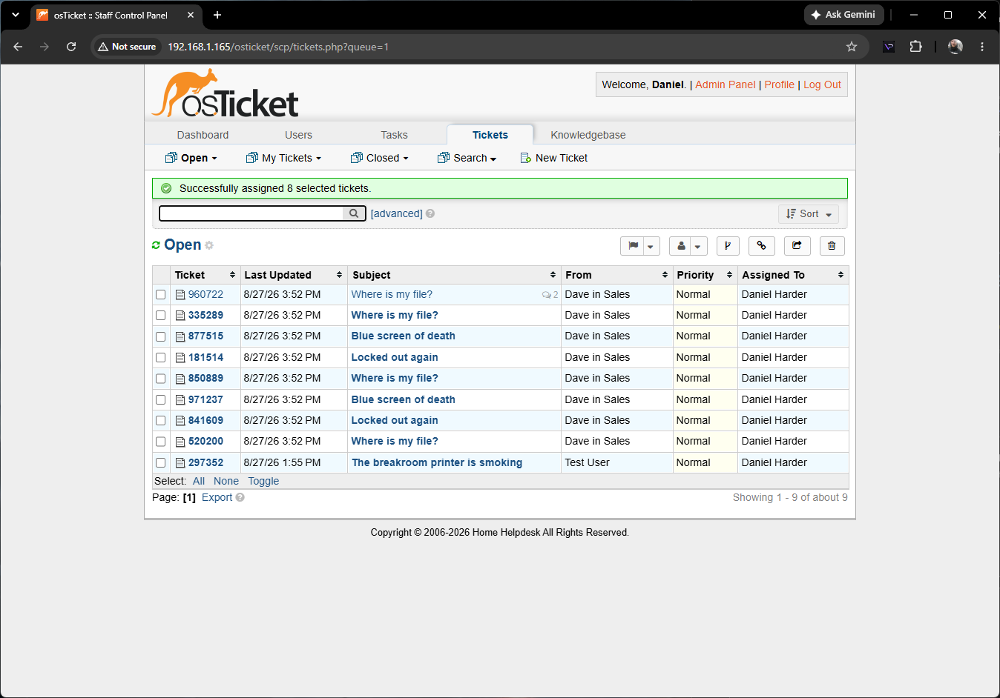
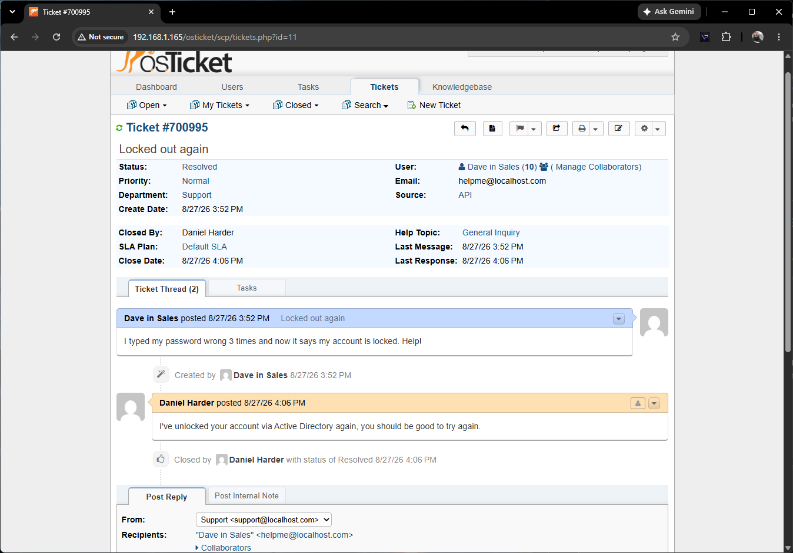
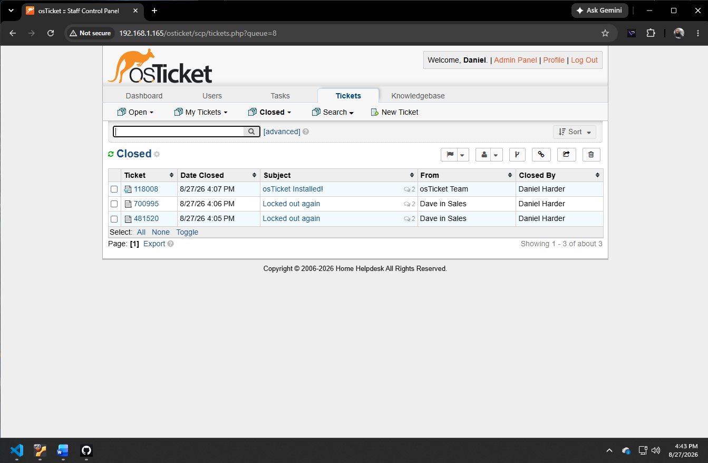
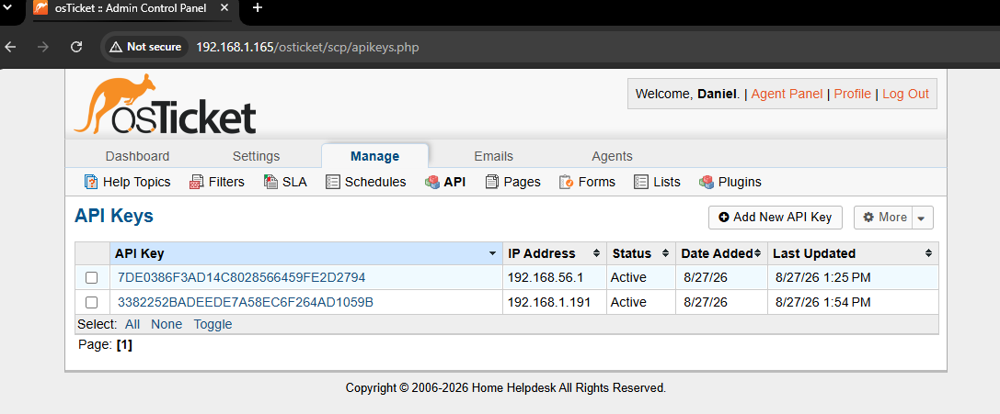

# osTicket API Automation Lab

A Python automation script designed to interface with a live osTicket help desk server. 

This project simulates a real-world IT environment by automatically generating and injecting randomized support tickets directly into the backend via the osTicket API.

## 📸 Project Demonstration

### 1. API Automation in Action
*Simultaneous view of the Python script executing the payload and the osTicket queue populating in real-time.*
 

### 2. Help Desk Operations & Ticket Resolution
*Demonstrating the staff control panel workflow, including claiming, responding to, and resolving simulated user issues.*

### 3. API Security & Network Binding
*Configuring the server to restrict API POST requests exclusively to the physical host machine's IP address (192.168.1.191).*

### 4. Completed Ticket Lifecycle
*The finalized view of the closed ticket queue after successfully processing the automated batch.*

## Core Skills Demonstrated
* **Systems Administration:** Provisioning and configuring an Ubuntu Linux VM, Apache web server, and MariaDB database to host an enterprise application.
* **Network Security:** Managing IP bindings and API key authentication to secure server endpoints.
* **Automation:** Writing Python scripts (using the `requests` library) to automate REST API POST requests with JSON payloads.
* **Help Desk Operations:** Managing the full lifecycle of support tickets from creation to resolution within a staff control panel.

## How It Works
The script (`ticket_blaster.py`) uses a loop to randomly select a user and a common IT issue (e.g., account lockouts, hardware failures). It formats this data into a JSON payload, authenticates using an API key tied to the host machine's physical IP, and pushes the batch of tickets to the server to populate the help desk queue.
